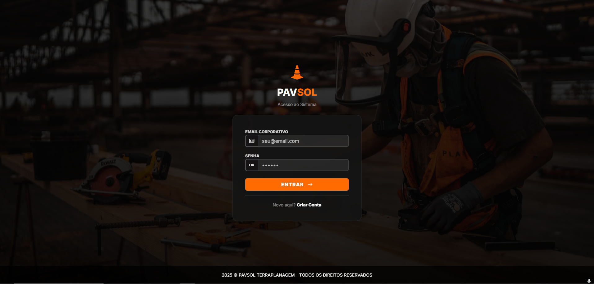
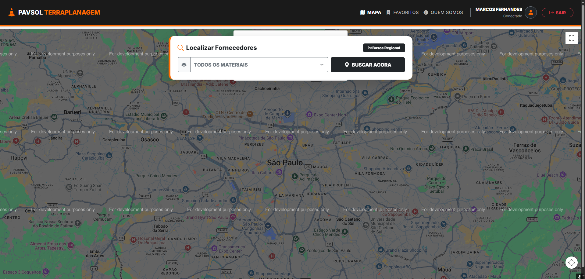

# PavSol Store Locator

## Screenshots

### Login



### Dashboard



The map is darkened and shows "For development purposes only" because the screenshot uses a test Google Maps API key without billing enabled. With a production key, the map displays normally.

PavSol is a Laravel application for earthmoving engineers who need to find nearby stores that sell construction and earthmoving materials. The dashboard uses Google Maps and the Google Places API to search suppliers around the user's location, show them on a map, and save useful stores as favorites.

## Stack

- Laravel 12
- PHP 8.2
- Blade
- MySQL
- Laravel UI
- Google Maps JavaScript API
- Google Places API
- Bootstrap 5

## Features

- Nearby store search for earthmoving and construction materials
- Interactive dashboard map with Google Maps markers
- Google Places text search biased around the user's current position
- Favorite stores saved per authenticated user
- Store routes through Google Maps directions
- Email-based two-factor authentication with a one-time code
- MySQL database for local development

## Installation

1. Install PHP dependencies:

   ```bash
   composer install
   ```

2. Install frontend dependencies:

   ```bash
   npm install
   ```

3. Copy the environment file:

   ```bash
   cp .env.example .env
   ```

   On Windows PowerShell:

   ```powershell
   Copy-Item .env.example .env
   ```

4. Generate the Laravel application key:

   ```bash
   php artisan key:generate
   ```

5. Create the MySQL database:

   ```sql
   CREATE DATABASE pavsol_db;
   ```

6. Configure your database credentials in `.env` before running migrations:

   ```env
   DB_CONNECTION=mysql
   DB_HOST=127.0.0.1
   DB_PORT=3306
   DB_DATABASE=pavsol_db
   DB_USERNAME=root
   DB_PASSWORD=
   ```

7. Run the migrations:

   ```bash
   php artisan migrate
   ```

8. Build frontend assets:

   ```bash
   npm run build
   ```

9. Add your own Google Maps API key in `resources/views/dashboard.blade.php`, replacing `YOUR_GOOGLE_MAPS_API_KEY`. The map and Places search require a valid key with the Google Maps JavaScript API and Places API enabled.

10. Start the development server:

   ```bash
   php artisan serve
   ```

The application will be available at the URL printed by Artisan, usually `http://127.0.0.1:8000`.

## Environment Notes

The project is configured to use MySQL by default:

```env
DB_CONNECTION=mysql
DB_DATABASE=pavsol_db
```

Email delivery is required for the two-factor login code. Configure the `MAIL_*` variables in your local `.env` file with your own SMTP provider when testing the authentication flow.
